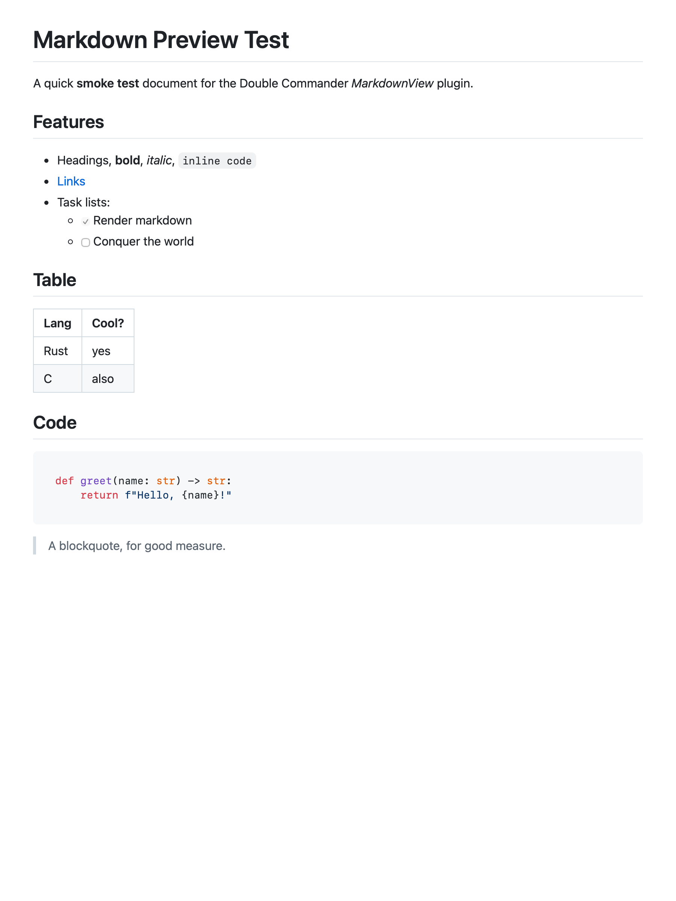

# Double Commander Plugins for macOS

Native plugins for [Double Commander](https://doublecmd.sourceforge.io/) on macOS,
built to a consistent engineering standard: **universal binaries** (Apple Silicon +
Intel), **headless tests**, **CI**, and a layered **safety gate** before anything ships.

This repo is also a worked example of how I build small native tools end-to-end —
investigate the platform, prove the mechanism with a focused test before writing the
feature, fix root causes instead of papering over them, and keep the result
reproducible and documented.

## Plugins

| Plugin | Type | What it does | Status |
|--------|------|--------------|--------|
| [`markdown-wlx`](markdown-wlx/) | WLX (lister) | Renders Markdown beautifully in DC's viewer (F3) — GitHub-style CSS, syntax highlighting, tables, task lists, light/dark. Toggle back to raw text anytime. | ✅ stable |

More plugins will follow; the repo layout and the [contributor guide](CONTRIBUTING.md)
are built for that.

## `markdown-wlx` preview



Press **F3** on any `.md` file and it opens rendered. The built-in viewer's mode
switch still lets you flip to the raw **Text** view (and back) at any time.

## Quick start

Requires macOS 11+ and the Xcode command-line tools (`xcode-select --install`).

```sh
cd markdown-wlx
./build.sh          # → build/MarkdownView.wlx  (universal: arm64 + x86_64)
# Quit Double Commander first (it rewrites its config on exit), then:
./install.sh        # installs to ~/Library/Preferences/doublecmd/ and registers it
```

Per-plugin details — supported extensions, how it works, uninstall — live in each
plugin's own README (e.g. [`markdown-wlx/README.md`](markdown-wlx/README.md)).

## What a "plugin" is here

A Double Commander plugin is a native shared library with a fixed C entry-point
table (the Total Commander plugin ABI). A **WLX** lister plugin like `markdown-wlx`
is a `.wlx` Mach-O dylib exporting `ListLoad`, `ListLoadNext`, `ListCloseWindow`,
`ListGetDetectString`, and `ListSetDefaultParams`. On macOS the window handles in
that ABI are `NSView*`, so a viewer plugin builds an `NSView` (here, a `WKWebView`)
and hands it back to DC.

The deeper design — the ABI, the rendering pipeline, and a couple of instructive
macOS gotchas (e.g. why `WKWebView` swallows the Escape key, and the fix) — is in
the [**project wiki**](../../wiki) and summarized in [`docs/ARCHITECTURE.md`](docs/ARCHITECTURE.md).

## Engineering standards

Every plugin in this collection aims to hold the same bar:

- **Native & universal** — one `.wlx` runs on Apple Silicon and Intel (`lipo` verified).
- **Tested** — a headless harness loads the real built plugin and asserts behavior
  (it renders; Escape reaches the host). GUI-bound tests run locally; CI verifies the
  build, architectures, and exported ABI symbols.
- **Reproducible** — third-party assets are vendored and attributed; the build is a
  single script with no hidden state.
- **Safe to publish** — a generic [`leak-guard`](scripts/leak-guard.sh) gate (secrets,
  private paths, OS cruft) runs in CI and as a pre-commit hook.
- **Root-cause fixes** — bugs are understood before they're patched; see the Escape-key
  case study in the wiki.

## Repository layout

```
.
├── markdown-wlx/            # the Markdown lister plugin (source, assets, tests, docs)
├── docs/                    # cross-plugin docs (architecture, adding a plugin)
├── scripts/leak-guard.sh    # generic pre-publish safety gate
├── .github/                 # issue/PR templates, CI workflow
├── CONTRIBUTING.md
├── CHANGELOG.md
└── LICENSE                  # MIT
```

## Contributing

See [CONTRIBUTING.md](CONTRIBUTING.md) for the build/test loop, the plugin layout
convention, and [docs/ADDING-A-PLUGIN.md](docs/ADDING-A-PLUGIN.md) for scaffolding a
new one. Issues and proposals are welcome via the templates.

## License

[MIT](LICENSE) © Nikolai Sachok. Bundled third-party libraries keep their own licenses —
see each plugin's `THIRD_PARTY_LICENSES.md`.
