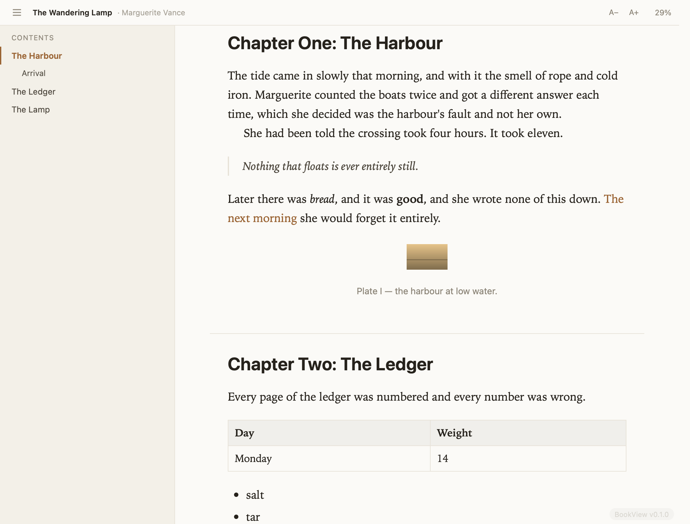

# BookView — Double Commander WLX plugin (macOS)

Reads **EPUB and FictionBook (FB2) e-books** in Double Commander's F3 viewer: a
contents sidebar, the whole book as one continuous reflowable column, cover and
metadata, and light / dark / sepia themes. Press **F3** on any `.epub`, `.fb2` or
`.fbz` and it opens as a book rather than as an archive or a wall of XML.

There was no e-book lister for Double Commander on macOS before this — the
existing ones (EPUB Lister, eBookInfo, SumatraLister) are Windows PE plugins and
cannot load into a Mach-O host. See [#19](https://github.com/NikolaiSachok/DC-plugins/issues/19)
and [#20](https://github.com/NikolaiSachok/DC-plugins/issues/20).



- **Contents sidebar** from the EPUB 3 `nav` document, the EPUB 2 NCX, or FB2
  section titles — nested, with the current chapter highlighted as you scroll
- **FictionBook structures** rendered as they were meant to read: epigraphs with
  their attribution, poems set in stanzas, cites, tables, and footnotes that jump
  to the notes body and back
- **Reading position remembered** per book for the session, and a progress readout
- **Text size** adjustable with `A-` / `A+` (or `-` / `+`); the choice sticks for
  the session
- **Cover** shown when the book doesn't already open on one
- **Nothing written to disk and nothing fetched from the network** — the book is
  served straight out of its container, in-process

## Requirements

macOS 11+ and the Xcode command-line tools (`xcode-select --install`) to build.
No other dependencies: decompression uses the system zlib, rendering uses WebKit.

## Build

```sh
./build.sh          # → build/BookView.wlx  (universal: arm64 + x86_64)
```

The script compiles both architectures, ad-hoc signs the result (`codesign -s -`,
which is all Double Commander needs), stages `assets/` beside the binary, and
prints the architectures and exported symbols so you can see the ABI is complete.

## Install

Quit Double Commander first — it rewrites its config on exit and will otherwise
overwrite the registration.

```sh
./install.sh
```

This copies the plugin and its assets to
`~/Library/Preferences/doublecmd/plugins/wlx/BookView/`, backs up
`doublecmd.xml`, and registers the plugin **before** the bundled `MacPreview`
plugin — whose detect string is the catch-all `(EXT!="")`, so anything after it
never gets a chance at a book file.

### Manual registration (alternative)

Configuration → Options → Plugins → WLX Plugins → Add, choose
`BookView.wlx`, set the detect string to `EXT="EPUB"|EXT="FB2"|EXT="FBZ"`, and
move the entry above `MacPreview`.

## Usage

| Action | How |
|--------|-----|
| Open a book | **F3** on an `.epub`, `.fb2` or `.fbz` |
| Show/hide contents | the ☰ button, or **t** |
| Jump to a chapter | click it in the contents |
| Follow a footnote | click the marker; it jumps to the note |
| Larger / smaller text | `A+` / `A-`, or **+** / **-** |
| Scroll | trackpad, arrows, Page Up/Down, Home/End |
| Close the viewer | **Esc** |
| Read it as raw text instead | the viewer's own mode switch |

## Configuration (optional)

Copy `BookView.ini.sample` to `BookView.ini` next to the installed `BookView.wlx`
and edit it. Settings are re-read every time you open a book, so there is no
restart. Keys: `theme` (auto/light/dark/sepia), `fontsize`, `maxwidth`,
`lineheight`, `justify`, `toc`, `publishercss`, `showversion` — each documented
inline in the sample.

By default the reader applies its own typography rather than the book's
stylesheets, so every book is legible and honours the theme. Set
`publishercss = 1` for books whose own layout matters (comics, poetry, heavily
designed pages); the publisher's CSS is then scoped to the text so it cannot
restyle the reader's own chrome.

## Supported extensions

| Extension | Format |
|-----------|--------|
| `.epub` | EPUB 2 and EPUB 3 |
| `.fb2` | FictionBook 2.0, including files declared `windows-1251` |
| `.fbz` | a zipped FictionBook |

Books whose chapters are declared in a legacy encoding are decoded from that
declaration rather than assumed to be UTF-8.

A `.fb2.zip` is **not** claimed: Double Commander sees its extension as `ZIP`, and
a plugin that matched every `.zip` would hijack archives it has no business
opening. Rename such a file to `.fbz` and it opens.

## How it works

An `.epub` is a ZIP (OCF) container of XHTML, CSS and images; an `.fb2` is a
single self-contained XML document. Rather than unpacking anything to a temporary
directory, the plugin serves the book straight out of its container through a
`WKURLSchemeHandler` on a private `x-book://` scheme:

```
x-book://book/<token>/__dcreader__/index.html     the generated reader shell
x-book://book/<token>/__dcreader__/reader.js      the reader itself
x-book://book/<token>/__dcreader__/document.fb2   the FictionBook, for an FB2 book
x-book://book/<token>/OEBPS/chapter1.xhtml        a file from inside an EPUB
```

Every resource is therefore same-origin — relative hrefs, images, fonts and
`fetch()` all behave normally — while nothing is written to disk and a path
either names an entry or resolves to nothing, so there is no filesystem to
escape into. The `<token>` changes on every load, so a reused web view can never
serve a previous book's cached resource.

Which format a file is gets decided from its **content, not its extension**: a ZIP
holding `META-INF/container.xml` is an EPUB, a ZIP holding a `.fb2` entry is a
zipped FictionBook, and a bare XML document naming FictionBook is an FB2. A
mis-named book still opens.

The native side (`BookView.m`, `zipreader.c`) owns container I/O and the page
shell. Both document models are parsed in `assets/reader.js`, where `DOMParser`
copes with real-world markup far better than hand-rolled parsing would:

- **EPUB** — `META-INF/container.xml` → OPF (metadata, manifest, spine) →
  `nav` document or NCX for the contents
- **FB2** — `<description>` for metadata and cover, `<binary>` elements for
  images, `<body>` sections for the text, and a named notes body for footnotes

Both produce the same thing — an ordered list of chapters plus a table of
contents — and everything downstream is shared. Chapters are appended one at a
time, so the first page is readable while the rest of the book is still arriving.

Book content is untrusted, and is treated that way:

- every EPUB chapter passes through **DOMPurify** before it is inserted
- **FB2 is never parsed as markup at all** — its elements are mapped one by one
  onto a fixed HTML vocabulary and only text crosses over, so a `<script>` in a
  FictionBook arrives as nothing
- only `x-book:` and `data:` URIs survive rewriting — an `http(s)` reference is
  dropped rather than fetched
- a **Content-Security-Policy** on the shell allows scripts and styles only from
  the plugin's own origin and forbids network connections outright

So a book cannot run script, phone home, or track the reader — by construction,
not by good behaviour.

`zipreader.c` reads the central directory itself and inflates with the system
zlib (macOS ships libarchive but no `archive.h` in the SDK). It handles stored
and deflated entries, ZIP64, and verifies CRC-32; oversized entries are refused.

### Escape closes the viewer

`WKWebView` swallows Esc, and Double Commander — a Lazarus/LCL app — dispatches
shortcuts through `NSApplication`'s `-sendEvent:`, not through synthetic
`-keyDown:` forwarding. The plugin moves focus off the web view and re-posts the
Escape event so LCL sees it and closes the viewer. This has to be verified in the
real Double Commander; a mock host will pass either way. See
[docs/ARCHITECTURE.md](../docs/ARCHITECTURE.md).

## Updating the bundled library

```sh
curl -L -o assets/dompurify.min.js \
  https://unpkg.com/dompurify@latest/dist/purify.min.js
```

Then rebuild and re-run the harnesses below — the sanitising assertions in
`test/test_host.m` are what tell you the new version still strips what it should.

## Uninstall

Remove the plugin entry in Configuration → Options → Plugins → WLX Plugins, then
delete `~/Library/Preferences/doublecmd/plugins/wlx/BookView/`.

## Test harnesses (development)

Sample books are generated rather than committed, so the repo carries no binary
fixtures:

```sh
python3 test/make_samples.py build/samples

# ZIP/OCF reader — headless, runs in CI
clang -O1 -Wall -Wextra -o build/zip_test test/zip_test.c zipreader.c -lz
./build/zip_test build/samples

# Full ABI + rendering + sanitising, against the real built .wlx (needs a GUI session)
clang -fobjc-arc -framework Cocoa -framework WebKit -o build/test_host test/test_host.m
./build/test_host build/BookView.wlx build/samples

# Esc reaches the host and closes the viewer
clang -fobjc-arc -framework Cocoa -framework WebKit -o build/esc_verify test/esc_verify.m
./build/esc_verify build/BookView.wlx build/samples/sample3.epub

# Cmd+C / Cmd+A reach the web view through the WLX ABI
clang -fobjc-arc -framework Cocoa -framework WebKit -o build/copy_verify test/copy_verify.m
./build/copy_verify build/BookView.wlx build/samples/sample2.epub

# Visual check: render a book and save a PNG
clang -fobjc-arc -framework Cocoa -framework WebKit -o build/snap_host test/snap_host.m
./build/snap_host build/BookView.wlx build/samples/sample3.epub build/shot.png 0 1100 860
```

`test_host.m` drives the actual WLX entry points — `ListGetDetectString`,
`ListLoad`, `ListLoadNext`, `ListCloseWindow` — against the plugin as built, and
asserts on the live DOM: that all four sample books render, that the contents come
out of the nav document, the NCX and FB2 section titles, that a `windows-1251`
chapter and a `windows-1251` FictionBook decode, that FB2 epigraphs, poems, cites,
tables, base64 images and footnote jumps are mapped, and that the hostile content
in the samples (inline `<script>`, an `onerror` handler, a remote image, an
`<iframe>`) reaches the page as inert text.

`copy_verify.m` drives `ListSendCommand` with `lc_selectall` and `lc_copy` the way
DC's viewer does, and asserts the system clipboard really changed — Double Commander
handles those two keys itself and dispatches them through the ABI, so a plugin that
does not export the entry point leaves both silently dead. The harness saves and
restores a text clipboard.

`esc_verify.m` checks that Escape is re-posted to the host so the viewer closes.
It is a regression net, not proof — Double Commander is a Lazarus/LCL app and a
mock host can pass while the real one fails, so press Esc in Double Commander
itself before shipping.
