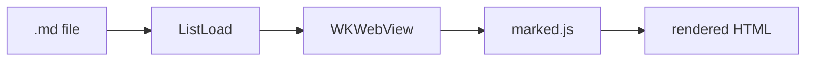

# Feature showcase

Exercises Mermaid, KaTeX math, code highlighting, tables, task lists, and nested
structure — used for manual and snapshot testing.

## Math (KaTeX)

Inline: the mass–energy relation is $E = mc^2$, and $\sqrt{a^2 + b^2}$ is the
hypotenuse. Block:

$$
\int_{-\infty}^{\infty} e^{-x^2}\,dx = \sqrt{\pi}
\qquad
\sum_{n=1}^{\infty} \frac{1}{n^2} = \frac{\pi^2}{6}
$$

## Diagram (Mermaid)



## Code (highlight.js)

```rust
fn main() {
    let greeting = "Hello, Double Commander!";
    println!("{greeting}");
}
```

## Tables, lists, tasks

| Feature | Status |
|---------|:------:|
| Mermaid | ✅ |
| Math    | ✅ |

- Nested lists
  - level two
    - level three
- Task list:
  - [x] render markdown
  - [ ] world domination

> A blockquote, for good measure.
